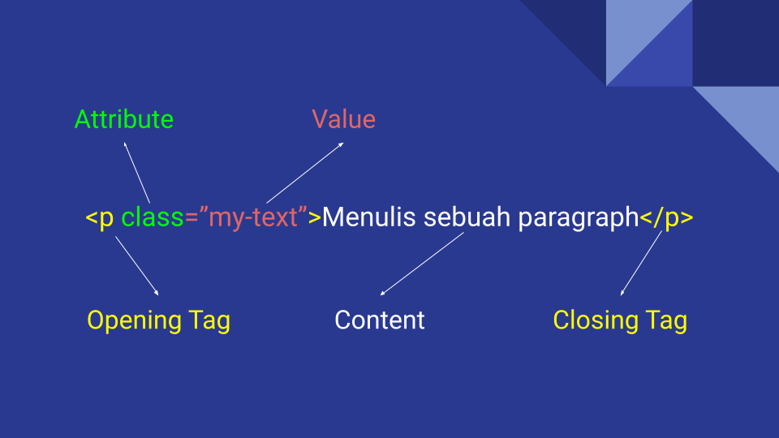

# Struktur HTML

## Anatomy of HTML Element

HTML terdiri dari beberapa elemen yang tersusun di dalam dokumen HTML. Secara anatomi, setiap elemen terdiri dari opening tag, content, dan closing tag. Di dalam opening tag terdapat atribut yang dapat diisi dengan nilai yang berbeda-beda.



### Opening Tag

Opening tag adalah penanda pembuka dari sebuah elemen HTML. Setelahnya akan dianggap sebagai content. Penulisan opening tag menggunakan simbol < kemudian ditambah dengan tag name dan di akhiri dengan simbol >

### Closing Tag

Closing tag adalah penanda pengakhir dari sebuah elemen HTML. Setelahnya akan terdapat tag name yang sama dengan opening tag, yang membedakan adalah ditambah dengan simbol /.

### Content

Content adalah bagian dari elemen HTML yang berisi beberapa karakter atau elemen lain.
Kita juga dapat mengisi content dengan lebih dari 1 elemen yang sama atau berbeda. Kita menyebutnya dengan istilah child element.

### Element

Element (Elemen) adalah istilah 1 bagian penuh mulai dari opening tag hingga closing tag.

### Self Closing / Auto Closing Tag

HTML juga memiliki variasi tag yang tidak membutuhkan closing tag. Kita menyebutnya dengan istilah self closing tag.

Fungsinya adalah untuk mewakili beberapa elemen void atau yang tidak memerlukan sebuah content di dalamnya, seperti memunculkan gambar, menambah spasi atau menerima input.

Bentuk deklarasinya cukup sederhana, yaitu hampir sama dengan opening tag namun ditambah simbol / setelah tag name.

```html
<!-- Contoh -->
<hr />

<input type="text" />
```

## HTML General Stucture

```html
<!DOCTYPE html>
<html lang="en">
  <head>
    <meta name="description" content="Deskripsi website kamu" />
    <meta name="viewport" content="width=device-width, initial-scale=1.0" />
    <title>Judul pada Title Bar</title>
  </head>
  <body>
    <h1>Hello World</h1>
  </body>
</html>
```

### \<!DOCTYPE html>

Dikenal dengan Document Type Declaration (DTD), yaitu deklarsi yang menentukan bahwa dokumen ini merupakan dokumen bertipe HTML 5

### \<html>

Elemen \<html> atau disebut juga elemen root (top-level element) merepresentasikan root dari sebuah dokumen HTML, di mana semua elemen lain harus merupakan turunan dari elemen ini.
Menambahkan atribut lang dengan tag bahasa yang valid menurut RFC 5646: Tag untuk Mengidentifikasi Bahasa (juga dikenal sebagai BCP 47) pada elemen <html> akan membantu teknologi screen reading menentukan bahasa yang tepat untuk ditampilkan. Tanpa atribut tersebut, screen readers biasanya akan menggunakan bahasa yang ditetapkan sistem operasi secara default.

### \<head>

Elemen HTML \<head> berisi informasi yang dapat dibaca mesin (metadata) tentang dokumen, seperti title, scripts, dan style sheets. Penempatan dari elemen ini sendiri berada di dalam tag \<html> dan tag

#### \<title>

Menyimpan judul dari dokumen dan title akan ditampilkan pada browser's title bar.

#### <meta name="description" content=""/>

description pada \<meta/> berguna untuk memberi ringkasan singkat dari halaman web. Hal ini penting untuk SEO, di mana deskripsi pada meta akan ditampilkan sebagai bagian dari pencarian pada halaman search engine results.

#### \<meta name="viewport" content=""/>

viewport merupakan area pandang yang terlihat oleh pengguna. viewport digunakan untuk memberikan petunjuk kepada browser bagaimana mengontrol dimensi dan skala pada halaman web.

Biasanya dalam viewport, value pada content berupa width=device-width, initial-scale=1.0, di mana width=device-width mengatur lebar halaman untuk mengikuti lebar layar pada sebuah perangkat dan initial-scale=1.0 menyetel tingkat zoom awal saat halaman ketika pertama kali dimuat oleh browser

### \<body>

Elemen HTML \<body> mewakili konten dokumen HTML seperti seperti judul, paragraf, gambar, hyperlink, tabel, daftar, dll. Dalam sebuah halaman HTML diperbolehkan hanya ada satu elemen \<body> dalam dokumen.
